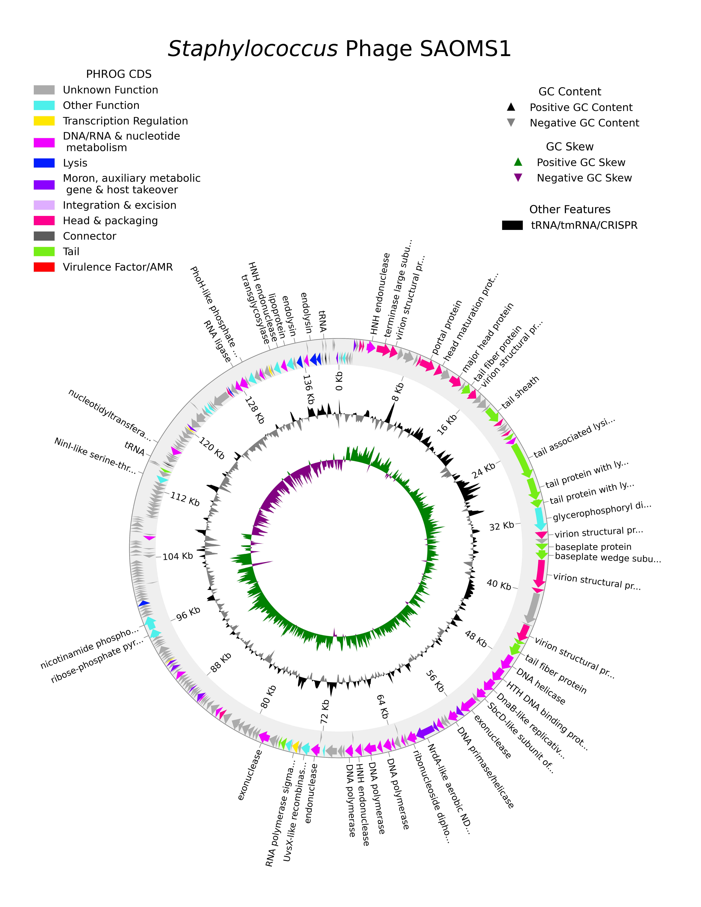

[](https://colab.research.google.com/github/gbouras13/pharokka/blob/master/run_pharokka_and_phold_and_phynteny.ipynb)

[](https://doi.org/10.1093/bioinformatics/btac776)
[](https://github.com/gbouras13/pharokka/actions/workflows/ci.yaml)
[](https://anaconda.org/bioconda/pharokka)
[](https://codecov.io/gh/gbouras13/pharokka)

[](https://anaconda.org/bioconda/pharokka)
[](https://img.shields.io/conda/dn/bioconda/pharokka)
[](https://badge.fury.io/py/pharokka)
[](https://pepy.tech/project/pharokka)

pharokka
=================

<p align="center">
  
</p>

Extra special thanks to Ghais Houtak for making Pharokka's logo.

## Fast Phage Annotation Tool

`pharokka` is a rapid standardised annotation tool for bacteriophage genomes and metagenomes.

If you are looking for rapid standardised annotation of bacterial genomes, please use [Bakta](https://github.com/oschwengers/bakta). [Prokka](https://github.com/tseemann/prokka), which inspired the creation and naming of `pharokka`, is another good option, but Bakta is [Prokka's worthy successor](https://twitter.com/torstenseemann/status/1565471892840259585).

# phold

If you like `pharokka`, you will probably love [phold](https://github.com/gbouras13/phold). `phold` uses structural homology to improve phage annotation. Benchmarking is ongoing but `phold` strongly outperforms `pharokka` in terms of annotation, particularly for less characterised phages such as those from metagenomic datasets.

`pharokka` still has features `phold` lacks for now (identifying tRNA, tmRNA, CRISPR repeats, and INPHARED taxonomy search), so it is recommended to run `phold` after running `pharokka`. 

`phold` takes the Genbank output of Pharokka as input. Therefore, if you have already annotated your phage(s) with Pharokka, you can easily update the annotation with more functional predictions with [phold](https://github.com/gbouras13/phold).

# Google Colab Notebooks

If you don't want to install `pharokka` or `phold` locally, you can run `pharokka` and `phold` (and [`phynteny`](https://github.com/susiegriggo/Phynteny)), or only `pharokka`, without any code using the [Google Colab notebook](https://colab.research.google.com/github/gbouras13/pharokka/blob/master/run_pharokka_and_phold_and_phynteny.ipynb).

* [`phynteny`](https://github.com/susiegriggo/Phynteny) uses a long-short term memory model trained on phage synteny (the conserved gene order across phages) to assign hypothetical phage proteins to a PHROG category - it might help you add extra PHROG category annotations to hypothetical genes remaining after you run `phold`. 
* Note: Phynteny will work only if your phage has fewer than 120 predicted proteins
* You can still use this notebook to run `pharokka` and/or `phold` if your phage(s) are too big - just don't run the Phynteny step!
  

# Table of Contents

- [pharokka](#pharokka)
  - [Fast Phage Annotation Tool](#fast-phage-annotation-tool)
- [phold](#phold)
- [Google Colab Notebooks](#google-colab-notebooks)
- [Table of Contents](#table-of-contents)
- [Quick Start](#quick-start)
- [Documentation](#documentation)
- [Paper](#paper)
- [Pharokka with Galaxy Europe Webserver](#pharokka-with-galaxy-europe-webserver)
- [Brief Overview](#brief-overview)
  - [Pharokka v 1.7.0 Update](#pharokka-v-170-update)
  - [Pharokka v 1.6.0 Update (11 January 2024)](#pharokka-v-160-update-11-january-2024)
  - [Pharokka v 1.5.0 Update (20 September 2023)](#pharokka-v-150-update-20-september-2023)
  - [Pharokka v 1.4.0 Update (27 August 2023)](#pharokka-v-140-update-27-august-2023)
  - [Pharokka v 1.3.0 Update](#pharokka-v-130-update)
- [Installation](#installation)
  - [Conda Installation](#conda-installation)
  - [Pip](#pip)
  - [Source](#source)
- [Database Installation](#database-installation)
- [Beginner Conda Installation](#beginner-conda-installation)
- [Usage](#usage)
- [Version Log](#version-log)
- [System](#system)
- [Time](#time)
- [Benchmarking v1.5.0](#benchmarking-v150)
- [Benchmarking v1.4.0](#benchmarking-v140)
- [Original Benchmarking (v1.1.0)](#original-benchmarking-v110)
- [Bugs and Suggestions](#bugs-and-suggestions)
- [Citation](#citation)

# Quick Start

The easiest way to install `pharokka` is via conda:

`conda install -c bioconda pharokka`

Followed by database download and installation:

`install_databases.py -o <path/to/databse_dir>`

And finally annotation:

`pharokka.py -i <phage fasta file> -o <output directory> -d <path/to/database_dir> -t <threads>`

As of `pharokka` v1.4.0, if you want extremely rapid PHROG annotations, use `--fast`:

`pharokka.py -i <phage fasta file> -o <output directory> -d <path/to/database_dir> -t <threads> --fast`

# Documentation

Check out the full documentation at [https://pharokka.readthedocs.io](https://pharokka.readthedocs.io).

# Paper

`pharokka` has been published in *Bioinformatics*:

George Bouras, Roshan Nepal, Ghais Houtak, Alkis James Psaltis, Peter-John Wormald, Sarah Vreugde, Pharokka: a fast scalable bacteriophage annotation tool, Bioinformatics, Volume 39, Issue 1, January 2023, btac776, https://doi.org/10.1093/bioinformatics/btac776.

If you use `pharokka`, please see the full [Citation](#citation) section for a list of all programs pharokka uses, in order to fully recognise the creators of these tools for their work.

# Pharokka with Galaxy Europe Webserver

Thanks to some amazing assistance from [Paul Zierep](https://github.com/paulzierep), you can run `pharokka` using the [Galaxy Europe webserver](https://usegalaxy.eu/?tool_id=toolshed.g2.bx.psu.edu%2Frepos%2Fiuc%2Fpharokka%2Fpharokka%2F1.2.1%2Bgalaxy1&version=1.2.1%20galaxy1). There is no plotting functionality at the moment.

So if you can't get `pharokka` to install on your machine for whatever reason or want a GUI to annotate your phage(s), please give it a go there.

# Brief Overview

<p align="center">
  
</p>

`pharokka` uses [PHANOTATE](https://github.com/deprekate/PHANOTATE), the only gene prediction program tailored to bacteriophages, as the default program for gene prediction. [Prodigal](https://github.com/hyattpd/Prodigal) implemented with [pyrodigal](https://github.com/althonos/pyrodigal) and [Prodigal-gv](https://github.com/apcamargo/prodigal-gv) implemented with [pyrodigal-gv](https://github.com/althonos/pyrodigal-gv) are also available as alternatives. Following this, functional annotations are assigned by matching each predicted coding sequence (CDS) to the [PHROGs](https://phrogs.lmge.uca.fr), [CARD](https://card.mcmaster.ca) and [VFDB](http://www.mgc.ac.cn/VFs/main.htm) databases using [MMseqs2](https://github.com/soedinglab/MMseqs2). As of v1.4.0, `pharokka` will also match each CDS to the PHROGs database using more sensitive Hidden Markov Models using [PyHMMER](https://github.com/althonos/pyhmmer). Pharokka's main output is a GFF file suitable for using in downstream pangenomic pipelines like [Roary](https://sanger-pathogens.github.io/Roary/). `pharokka` also generates a `cds_functions.tsv` file, which includes counts of CDSs, tRNAs, tmRNAs, CRISPRs and functions assigned to CDSs according to the PHROGs database. See the full [usage](#usage) and check out the full [documentation](https://pharokka.readthedocs.io) for more details.  

## Pharokka v 1.7.0 Update

You can run `pharokka_multiplotter.py` to plot as many phage(s) as you want.

It requires the `pharokka` output Genbank file (here, `pharokka.gbk`). It will save plots for each contig in the output directory (here `pharokka_plots_output_directory`). 

e.g.

```
pharokka_multiplotter.py -g pharokka.gbk  -o pharokka_plots_output_directory 
```

## Pharokka v 1.6.0 Update (11 January 2024)

* Fixes a variety of bugs (#300 `pharokka_proteins.py` crashing if it found VFDB hits, #303 errors in the `.tbl` format, #316 errors with types and where custom HMM dbs had identical scored hits, #317 types and #320 deprecated GC function)
* Adds `--mash_distance` and `--minced_args` as parameters (#299 thanks @iferres).

## Pharokka v 1.5.0 Update (20 September 2023)

* Adds support for `pyrodigal-gv` implementing `prodigal-gv` as a gene predictor for alternate genetic codes ([pyrodigal-gv](https://github.com/althonos/pyrodigal-gv) and [prodigal-gv](https://github.com/apcamargo/prodigal-gv)). This can be specified with `-g prodigal-gv` and is recommended for metagenomic input datasets. Thanks to @[althonos](https://github.com/althonos) and @[apcamargo](https://github.com/apcamargo) for making this possible, and to @[asierFernandezP](https://github.com/asierFernandezP) for raising this as an issue in the first place [here](https://github.com/gbouras13/pharokka/issues/290).
* `-g prodigal` and `-g prodigal-gv` should be much faster thanks to multithread support added by the inimitable @[althonos](https://github.com/althonos).
* Adds checks to determine if your input FASTA has duplicated [contig headers](https://github.com/gbouras13/pharokka/issues/293). Thanks @[thauptfeld](https://github.com/thauptfeld) for raising this.
* Genbank format output will be designated with PHG not VRL.
* The `_length_gc_cds_density.tsv` and `_cds_final_merged_output.tsv` files now contain the translation table/genetic code for each contig.
* `--skip_mash` flag added to skip finding the closest match for each contig in INPHARED using mash.
* `--skip_extra_annotations` flag added to skip running tRNA-scanSE, MinCED and Aragorn in case you only want CDS predictions and functional annotations.


## Pharokka v 1.4.0 Update (27 August 2023)

`pharokka` v1.4.0 is a large update implementing:

* More sensitive search for PHROGs using Hidden Markov Models (HMMs) using the amazing [PyHMMER](https://github.com/althonos/pyhmmer).
* By default, `pharokka` will now run searches using both MMseqs2 (PHROGs, CARD and VFDB) and HMMs (PHROGs). MMseqs2 was kept for PHROGs as it provides more information than the HMM results (e.g. sequence alignment identities & top hit PHROG protein) if it finds a hit. 
* `--fast` or `--hmm_only` which only runs PyHMMER on PHROGs. It will not run MMseqs2 at all on PHROGs, CARD or VFDB. For phage isolates, this will be much faster than v1.3.2, but you will not get CARD or VFDB annotations. For metagenomes, this will be (much) slower though!
* Other changes in the codebase should make `pharokka` v1.4.0 run somewhat faster than v1.3.2, even if PyHMMER is not used and `--mmseqs2_only` is specified.
* Updated databases as of 23 August 2023. You will need to download the new `pharokka` v1.4.0 databases. The VFDB database is now clustered at 50% sequence identity (which speeds up runtime).
* `--mmseqs2_only` which will essentially run `pharokka` v1.3.2 and is default in meta mode `-m` or `--meta`. 
* `pharokka_proteins.py`, which takes an input file of amino acid proteins in FASTA format and runs MMseqs2 (PHROGs, CARD, VFDB) and PyHMMER (PHROGs). See the [proteins documentation](docs/proteins.md) for more details.
* `--custom_hmm`, which allows for custom HMM profile databases to be used with `pharokka`.
* `create_custom_hmm.py` which facilitates  the creation of a HMM profile database from multiple sequence alignments.  See the [documentation](docs/custom.md) for more details about how to create a compatible HMM profile database.
* `--dnaapler`, which automatically detects and reorients your phage to start with the large terminase subunit. For more information, see [dnaapler](https://github.com/gbouras13/dnaapler).
* `--genbank`, which allows for genbank format input with `-i`. This will take all (custom) CDS calls in genbank file and PHANOTATE/pyrodigal will not be run. So if you have done manual gene curation, this option is recommended.
* Fixes to `-c`, which should now work with `-g prodigal` (thanks Alistair Legione for the fixes).

## Pharokka v 1.3.0 Update

`pharokka` v1.3.0 implements `pharokka_plotter.py`, which creates a simple circular genome plot using the amazing [pyCirclize](https://github.com/moshi4/pyCirclize) package with output in PNG format. All CDS are coloured according to their PHROG functional group. 

It is reasonably customisable and is designed for single input phage contigs. If an input FASTA with multiple contigs is entered, it will only plot the first contig. 

It requires the input FASTA, `pharokka` output directory, and the `-p` or `--prefix` value used with `pharokka` if specified. 

You can run `pharokka_plotter.py` in the following form

```
pharokka_plotter.py -i input.fasta -n pharokka_plot -o pharokka_output_directory 
```

This will create `pharokka_plot.png` as an output file plot of your phage.

An example plot is included below made with the following command (assuming Pharokka has been run with `SAOMS1_pharokka_output_directory` as the output directory).

``` 
pharokka_plotter.py -i test_data/SAOMS1.fasta -n SAOMS1_plot -o SAOMS1_pharokka_output_directory --interval 8000 --annotations 0.5 --plot_title '${Staphylococcus}$ Phage SAOMS1'
```

<p align="center">
  
</p>

SAOMS1 phage (GenBank: MW460250.1) was isolated and sequenced by: Yerushalmy, O., Alkalay-Oren, S., Coppenhagen-Glazer, S. and Hazan, R. from the Institute of Dental Sciences and School of Dental Medicine, Hebrew University, Israel.

Please see [plotting](docs/plotting.md) for details on all plotting parameter options. 

# Installation

## Conda Installation 

The easiest way to install `pharokka` is via conda. For inexperienced command line users, this method is highly recommended.

`conda install -c bioconda pharokka`

This will install all the dependencies along with `pharokka`. The dependencies are listed in environment.yml.

If conda is taking a long time to solve the environment, try using mamba:

```
conda install mamba
mamba install -c bioconda pharokka
```

## Pip

As of v1.4.0, you can also install the python components of `pharokka` with pip.

```
pip install pharokka
```

You will still need to install the non-python dependencies manually.

## Source

Alternatively, the development version of `pharokka` (which may include new, untested features) can be installed manually via github. 

```
git clone https://github.com/gbouras13/pharokka.git
cd pharokka
pip install -e .
pharokka.py --help
```

The dependencies found in environment.yml will then need to be installed manually.

For example using conda to install the required dependencies:

```
conda env create -f environment.yml
conda activate pharokka_env
# assuming you are in the pharokka directory 
# installs pharokka from source
pip install -e .
pharokka.py --help
```

# Database Installation

To install the `pharokka` database to the default directory:

`install_databases.py -d`

If you would like to specify a different database directory (recommended), that can be achieved as follows:

`install_databases.py -o <path/to/databse_dir>`

If this does not work, you an alternatively download the databases from Zenodo at https://zenodo.org/record/8276347/files/pharokka_v1.4.0_databases.tar.gz and untar the directory in a location of your choice.

If you prefer to use the command line:

```
wget "https://zenodo.org/record/8267900/files/pharokka_v1.4.0_databases.tar.gz"
tar -xzf pharokka_v1.4.0_databases.tar.gz
```

which will create a directory called "pharokka_v1.4.0_databases" containing the databases.

# Beginner Conda Installation

If you are new to using the command-line, please install conda using the following instructions.

1. Install [Anaconda](https://www.anaconda.com/products/distribution). I would recommend [miniconda](https://docs.conda.io/en/latest/miniconda.html).
2. Assuming you are using a Linux x86_64 machine (for other architectures, please replace the URL with the appropriate one on the [miniconda](https://docs.conda.io/en/latest/miniconda.html) website).

`curl -O https://repo.anaconda.com/miniconda/Miniconda3-latest-Linux-x86_64.sh`

For Mac (Intel, will also work with M1):

`curl -O https://repo.anaconda.com/miniconda/Miniconda3-latest-MacOSX-x86_64.sh`

3. Install miniconda and follow the prompts.

`sh Miniconda3-latest-Linux-x86_64.sh`

4. After installation is complete, you should add the following channels to your conda configuration:

```
conda config --add channels defaults
conda config --add channels bioconda
conda config --add channels conda-forge
```

5. After this, conda should be installed (you may need to restart your terminal). It is recommended that mamba is also installed, as it will solve the enviroment quicker than conda:

`conda install mamba`

 6. Finally, I would recommend installing `pharokka` into a fresh environment. For example to create an environment called pharokkaENV with `pharokka` installed:

```
mamba create -n pharokkaENV pharokka
conda activate pharokkaENV
install_databases.py -h
pharokka.py -h
```

# Usage

Once the databases have finished downloading, to run `pharokka`:

`pharokka.py -i <fasta file> -o <output directory> -t <threads>`

To specify a different database directory (recommended):

`pharokka.py -i <fasta file> -o <output directory> -d <path/to/database_dir> -t <threads> -p <prefix>`

For a full explanation of all arguments, please see [usage](docs/run.md).

pharokka defaults to 1 thread.

```
usage: pharokka.py [-h] [-i INFILE] [-o OUTDIR] [-d DATABASE] [-t THREADS] [-f] [-p PREFIX] [-l LOCUSTAG] [-g GENE_PREDICTOR] [-m] [-s]
                   [-c CODING_TABLE] [-e EVALUE] [--fast] [--mmseqs2_only] [--meta_hmm] [--dnaapler] [--custom_hmm CUSTOM_HMM] [--genbank]
                   [--terminase] [--terminase_strand TERMINASE_STRAND] [--terminase_start TERMINASE_START] [--skip_extra_annotations]
                   [--skip_mash] [--minced_args MINCED_ARGS] [--mash_distance MASH_DISTANCE] [-V] [--citation]

pharokka: fast phage annotation program

options:
  -h, --help            show this help message and exit
  -i INFILE, --infile INFILE
                        Input genome file in fasta format.
  -o OUTDIR, --outdir OUTDIR
                        Directory to write the output to.
  -d DATABASE, --database DATABASE
                        Database directory. If the databases have been installed in the default directory, this is not required. Otherwise specify the path.
  -t THREADS, --threads THREADS
                        Number of threads. Defaults to 1.
  -f, --force           Overwrites the output directory.
  -p PREFIX, --prefix PREFIX
                        Prefix for output files. This is not required.
  -l LOCUSTAG, --locustag LOCUSTAG
                        User specified locus tag for the gff/gbk files. This is not required. A random locus tag will be generated instead.
  -g GENE_PREDICTOR, --gene_predictor GENE_PREDICTOR
                        User specified gene predictor. Use "-g phanotate" or "-g prodigal" or "-g prodigal-gv" or "-g genbank". 
                        Defaults to phanotate (not required unless prodigal is desired).
  -m, --meta            meta mode for metavirome input samples
  -s, --split           split mode for metavirome samples. -m must also be specified. 
                        Will output separate split FASTA, gff and genbank files for each input contig.
  -c CODING_TABLE, --coding_table CODING_TABLE
                        translation table for prodigal. Defaults to 11.
  -e EVALUE, --evalue EVALUE
                        E-value threshold for MMseqs2 database PHROGs, VFDB and CARD and PyHMMER PHROGs database search. Defaults to 1E-05.
  --fast, --hmm_only    Runs PyHMMER (HMMs) with PHROGs only, not MMseqs2 with PHROGs, CARD or VFDB. 
                        Designed for phage isolates, will not likely be faster for large metagenomes.
  --mmseqs2_only        Runs MMseqs2 with PHROGs, CARD and VFDB only (same as Pharokka v1.3.2 and prior). Default in meta mode.
  --meta_hmm            Overrides --mmseqs2_only in meta mode. Will run both MMseqs2 and PyHMMER.
  --dnaapler            Runs dnaapler to automatically re-orient all contigs to begin with terminase large subunit if found. 
                        Recommended over using '--terminase'.
  --custom_hmm CUSTOM_HMM
                        Run pharokka with a custom HMM profile database suffixed .h3m. 
                        Please use create this with the create_custom_hmm.py script.
  --genbank             Flag denoting that -i/--input is a genbank file instead of the usual FASTA file. 
                         The CDS calls in this file will be preserved and re-annotated.
  --terminase           Runs terminase large subunit re-orientation mode. 
                        Single genome input only and requires --terminase_strand and --terminase_start to be specified.
  --terminase_strand TERMINASE_STRAND
                        Strand of terminase large subunit. Must be "pos" or "neg".
  --terminase_start TERMINASE_START
                        Start coordinate of the terminase large subunit.
  --skip_extra_annotations
                        Skips tRNAscan-se, MINced and Aragorn.
  --skip_mash           Skips running mash to find the closest match for each contig in INPHARED.
  --minced_args MINCED_ARGS
                        extra commands to pass to MINced (please omit the leading hyphen for the first argument). You will need to use quotation marks e.g. --minced_args "minNR 2 -minRL 21"
  --mash_distance MASH_DISTANCE
                        mash distance for the search against INPHARED. Defaults to 0.2.
  -V, --version         Print pharokka Version
  --citation            Print pharokka Citation
  ```

# Version Log

A brief description of what is new in each update of `pharokka` can be found in the HISTORY.md file.

# System

`pharokka` has been tested on Linux and MacOS (M1 and Intel).

# Time

On a standard 16GB RAM laptop specifying 8 threads, `pharokka` should take between 3-10 minutes to run for a single phage, depending on the genome size. 

In `--fast` mode, it should take 45-75 seconds.

# Benchmarking v1.5.0 

`pharokka v1.5.0` was run on the 673 crAss phage dataset to showcase the improved CDS prediction of `-g prodigal-gv` for metagenomic datasets where some phages likely have alternative genetic codes (i.e. not 11). 

All benchmarking was conducted on a Intel® Core™ i7-10700K CPU @ 3.80GHz on a machine running Ubuntu 20.04.6 LTS with 8 threads (`-t 8`). `pyrodigal-gv v0.1.0` and `pyrodigal v3.0.0` were used respectively. 

| 673 crAss-like genomes | `pharokka` v1.5.0 `-g prodigal-gv` | `pharokka` v1.5.0 `-g prodigal` | 
|------------------------|------------------------------------|----------------------------------|
| Total CDS              | **81730**                          | 91999                            | 
| Annotated Function CDS | **20344**                          | 17458                            | 
| Unknown Function CDS   | 61386                              | 74541                            |
| Contigs with genetic code 15 | 229                          | NA                               | 
| Contigs with genetic code 4 | 38                            | NA                               | 
| Contigs with genetic code 11 | 406                          | 673                              | 

Fewer (larger) CDS were predicted more accurately, leading to an increase in the number of coding sequences with annotated functions. Approximately 40% of contigs in this dataset were predicted to use non-standard genetic codes according to `pyrodigal-gv`.

# Benchmarking v1.4.0 

`pharokka` v1.4.0 has also been run on phage SAOMS1 and also the same 673 crAss phage dataset to showcase:

1. The improved sensitivity of gene annotation with PyHMMER and a demonstration of how `--fast` is slower for metagenomes. 
    * If you can deal with the compute cost (especially for large metagenomes), I highly recommend `--fast` or  `--meta_hmm` for metagenomes given how much more sensitive HMM search is.
2. The large speed-up over v1.3.2 with `--fast` for phage isolates - with the proviso that no virulence factors or AMR genes will be detected. 
3. The slight speed-up over v1.3.2 with `--mmseqs2_only`.

All benchmarking was conducted on a Intel® Core™ i7-10700K CPU @ 3.80GHz on a machine running Ubuntu 20.04.6 LTS with 16 threads (`-t 16`). 

SAOMS1 was run with Phanotate

| Phage SAOMS1           | `pharokka` v1.4.0 `--fast`  | `pharokka` v1.4.0 | `pharokka` v1.3.2 |   
|------------------------|-----------------------------|-------------------|-----------------|
| Time (min)             | 0.70                        | 3.73              | 5.08            | 
| CDS                    | 246                         | 246               | 246             | 
| Annotated Function CDS | 93                          | 93                | 92              | 
| Unknown Function CDS   | 153                         | 153               | 154             |  

The 673 crAss-like genomes were run with `-m` (defaults to `--mmseqs2_only` in v 1.4.0) and with `-g prodigal` (pyrodigal v2.1.0).

| 673 crAss-like genomes | `pharokka` v1.4.0 `--fast`  | `pharokka` v1.4.0 `--mmseqs2_only` | `pharokka` v1.3.2 |
|------------------------|---------------------------|----------------------------------|-----------------|
| Time (min)             | 35.62                     | 11.05                            | 13.27           |
| CDS                    | 91999                     | 91999                            | 91999           |
| Annotated Function CDS | **16713**                 | 9150                             | 9150            |
| Unknown Function CDS   | 75286                     | 82849                            | 82849           |


# Original Benchmarking (v1.1.0)

`pharokka` (v1.1.0) has been benchmarked on an Intel Xeon CPU E5-4610 v2 @ 2.30 specifying 16 threads. Below is benchamarking comparing `pharokka` run with PHANOTATE and Prodigal against Prokka v1.14.6 run with PHROGs HMM profiles, as modified by Andrew Millard (https://millardlab.org/2021/11/21/phage-annotation-with-phrogs/).

Benchmarking was conducted on Enterbacteria Phage Lambda (Genbank accession J02459) Staphylococcus Phage SAOMS1 (Genbank Accession MW460250) and 673 crAss-like phage genomes in one multiFASTA input taken from Yutin, N., Benler, S., Shmakov, S.A. et al. Analysis of metagenome-assembled viral genomes from the human gut reveals diverse putative CrAss-like phages with unique genomic features. Nat Commun 12, 1044 (2021) https://doi.org/10.1038/s41467-021-21350-w.


For the crAss-like phage genomes, `pharokka` meta mode `-m` was enabled.

| Phage Lambda            | `pharokka` PHANOTATE | `pharokka` Prodigal | Prokka with PHROGs | 
|------------------------|--------------------|-------------------|--------------------|
| Time (min)             | 4.19               | 3.88              | 0.27               |
| CDS                    | 88                 | 61                | 62                 | 
| Coding Density (%)     | 94.55              | 83.69             | 84.96              | 
| Annotated Function CDS | 43                 | 37                | 45                 |  
| Unknown Function CDS   | 45                 | 24                | 17                 | 

| Phage SAOMS1           | `pharokka` PHANOTATE | `pharokka` Prodigal | Prokka with PHROGs |   
|------------------------|--------------------|-------------------|--------------------|
| Time (min)             | 4.26               | 3.89              | 0.93               | 
| CDS                    | 246                | 212               | 212                | 
| Coding Density (%)     | 92.27              | 89.69             | 89.31              |  
| Annotated Function CDS | 92                 | 93                | 92                 | 
| Unknown Function CDS   | 154                | 119               | 120                |  

| 673 crAss-like genomes from Yutin et al., 2021 | `pharokka` PHANOTATE Meta Mode | `pharokka` Prodigal Meta Mode  | Prokka with PHROGs |
|------------------------------------------------|------------------------------|------------------------------|--------------------|
| Time (min)                                     | 106.55                       | 11.88                        | 252.33             |
| Time Gene Prediction (min)                     | 96.21                        | 3.4                          | 5.12               |
| Time tRNA Prediction (min)                     | 1.25                         | 1.08                         | 0.3                |
| Time Database Searches (min)                   | 6.75                         | 5.58                         | 238.77             |
| CDS                                            | 138628                       | 90497                        | 89802              |
| Contig Min Coding Density (%)                  | 66.01                        | 46.18                        | 46.13              |
| Contig Max Coding Density (%)                  | 98.86                        | 97.85                        | 97.07              |
| Annotated Function CDS                         | 9341                         | 9228                         | 14461              |
| Unknown Function CDS                           | 129287                       | 81269                        | 75341              |

`pharokka` scales well for large metavirome datasets due to the speed of MMseqs2. In fact, as the size of the input file increases, the extra time taken is required for running gene prediction (particularly PHANOTATE) and tRNA-scan SE2 - the time taken to conduct MMseqs2 searches remain small due to its many vs many approach. 

If you require  fast annotations of extremely large datasets (i.e. thousands of input contigs), running `pharokka` with Prodigal (`-g prodigal`) is recommended.

 
# Bugs and Suggestions

If you come across bugs with `pharokka`, or would like to make any suggestions to improve the program, please open an issue or email george.bouras@adelaide.edu.au.

# Citation

George Bouras, Roshan Nepal, Ghais Houtak, Alkis James Psaltis, Peter-John Wormald, Sarah Vreugde, Pharokka: a fast scalable bacteriophage annotation tool, Bioinformatics, Volume 39, Issue 1, January 2023, btac776, https://doi.org/10.1093/bioinformatics/btac776

If you use `pharokka`, I would recommend a citation in your manuscript along the lines of:

* All phages were annotated with Pharokka v ___ (Bouras, et al. 2023). Specifically, coding sequences (CDS) were predicted with PHANOTATE (McNair, et al. 2019), tRNAs were predicted with tRNAscan-SE 2.0 (Chan, et al. 2021), tmRNAs were predicted with Aragorn (Laslett, et al. 2004) and CRISPRs were preducted with CRT (Bland, et al. 2007). Functional annotation was generated by matching each CDS to the PHROGs (Terzian, et al. 2021), VFDB (Chen, et al. 2005) and CARD (Alcock, et al. 2020) databases using MMseqs2 (Steinegger, et al. 2017) and PyHMMER (Larralde, et al. 2023). Contigs were matched to their closest hit in the INPHARED database (Cook, et al. 2021) using mash (Ondov, et al. 2016). Plots were created with pyCirclize (Shimoyama 2022).

With the following full citations for the constituent tools below where relevant:

* Cook R, Brown N, Redgwell T, Rihtman B, Barnes M, Clokie M, Stekel DJ, Hobman JL, Jones MA, Millard A. INfrastructure for a PHAge REference Database: Identification of Large-Scale Biases in the Current Collection of Cultured Phage Genomes. PHAGE. 2021. Available from: http://doi.org/10.1089/phage.2021.0007.
* McNair K., Zhou C., Dinsdale E.A., Souza B., Edwards R.A. (2019) "PHANOTATE: a novel approach to gene identification in phage genomes", Bioinformatics, https://doi.org/10.1093/bioinformatics/btz26.
* Chan, P.P., Lin, B.Y., Mak, A.J. and Lowe, T.M. (2021) "tRNAscan-SE 2.0: improved detection and functional classification of transfer RNA genes", Nucleic Acids Res., https://doi.org/10.1093/nar/gkab688.
* Steinegger M. and Soeding J. (2017), "MMseqs2 enables sensitive protein sequence searching for the analysis of massive data sets", Nature Biotechnology https://doi.org/10.1038/nbt.3988.
* Ondov, B.D., Treangen, T.J., Melsted, P. et al. Mash: fast genome and metagenome distance estimation using MinHash. Genome Biol 17, 132 (2016). https://doi.org/10.1186/s13059-016-0997-x.
* Terzian P., Olo Ndela E., Galiez C., Lossouarn J., Pérez Bucio R.E., Mom R., Toussaint A., Petit M.A., Enault F., "PHROG : families of prokaryotic virus proteins clustered using remote homology", NAR Genomics and Bioinformatics, (2021), https://doi.org/10.1093/nargab/lqab067.
* Bland C., Ramsey L., Sabree F., Lowe M., Brown K., Kyrpides N.C., Hugenholtz P. , "CRISPR Recognition Tool (CRT): a tool for automatic detection of clustered regularly interspaced palindromic repeats", BMC Bioinformatics, (2007), https://doi.org/10.1186/1471-2105-8-209.
* Laslett D., Canback B., "ARAGORN, a program to detect tRNA genes and tmRNA genes in nucleotide sequences.", Nucleic Acids Research (2004) https://doi.org/10.1093/nar/gkh152.
* Chen L., Yang J., Yao Z., Sun L., Shen Y., Jin Q., "VFDB: a reference database for bacterial virulence factors", Nucleic Acids Research (2005) https://doi.org/10.1093/nar/gki008.
* Alcock et al, "CARD 2020: antibiotic resistome surveillance with the comprehensive antibiotic resistance database." Nucleic Acids Research (2020) https://doi.org/10.1093/nar/gkz935.
* Larralde, M., (2022). Pyrodigal: Python bindings and interface to Prodigal, an efficient method for gene prediction in prokaryotes. Journal of Open Source Software, 7(72), 4296. doi:10.21105/joss.04296.
* Larralde M., Zeller G., (2023). PyHMMER: a Python library binding to HMMER for efficient sequence analysis, Bioinformatics, Volume 39, Issue 5, May 2023, btad214, https://doi.org/10.1093/bioinformatics/btad214.
* Larralde M. and Camargo A., (2023) Pyrodigal-gv: A Pyrodigal extension to predict genes in giant viruses and viruses with alternative genetic code. https://github.com/althonos/pyrodigal-gv.
* Shimoyama, Y. (2022). pyCirclize: Circular visualization in Python [Computer software]. https://github.com/moshi4/pyCirclize.
