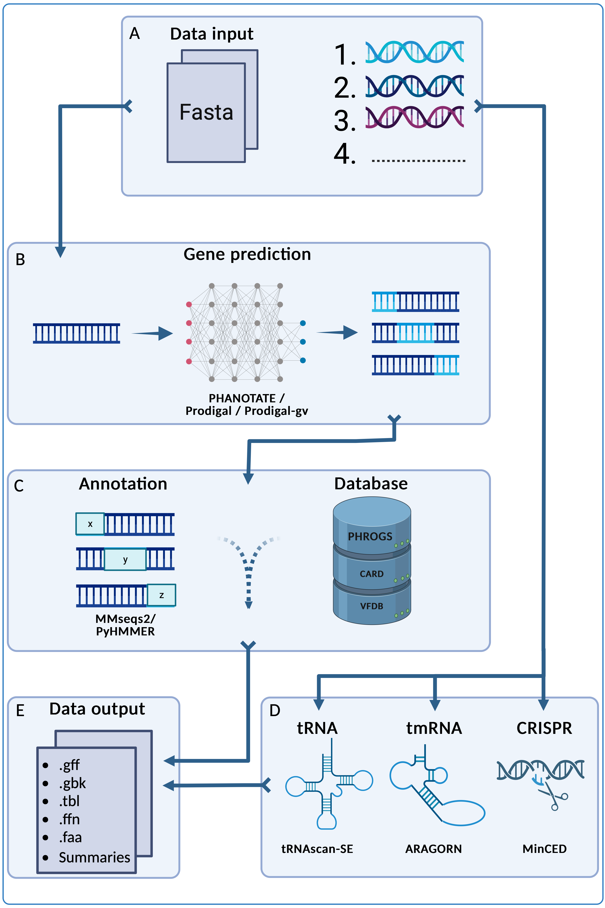

pharokka
===============

Fast Phage Annotation Tool
------------

pharokka is a rapid standardised annotation tool for bacteriophage genomes and metagenomes.

If you are looking for rapid standardised annotation of bacterial genomes, please use [prokka](https://github.com/tseemann/prokka), which inspired the creation of pharokka, or [bakta](https://github.com/oschwengers/bakta).

Paper
-----------

pharokka has been recently published in *Bioinformatics*:

George Bouras, Roshan Nepal, Ghais Houtak, Alkis James Psaltis, Peter-John Wormald, Sarah Vreugde, Pharokka: a fast scalable bacteriophage annotation tool, Bioinformatics, Volume 39, Issue 1, January 2023, btac776, https://doi.org/10.1093/bioinformatics/btac776.

If you use pharokka, please see the full [Citation](#citation) section for a list of all programs pharokka uses, in order to fully recognise the creators of these tools for their work.

Brief Overview
-----------

<p align="center">
  
</p>

pharokka uses [PHANOTATE](https://github.com/deprekate/PHANOTATE), the only gene prediction program tailored to bacteriophages, as the default program for gene prediction. [Prodigal](https://github.com/hyattpd/Prodigal) is also available as an alternative. Following this, functional annotations are assigned by matching each predicted coding sequence (CDS) to the [PHROGs](https://phrogs.lmge.uca.fr), [CARD](https://card.mcmaster.ca) and [VFDB](http://www.mgc.ac.cn/VFs/main.htm) databases using [MMseqs2](https://github.com/soedinglab/MMseqs2). pharokka's main output is a GFF file suitable for using in downstream pangenomic pipelines like [Roary](https://sanger-pathogens.github.io/Roary/). pharokka also generates a `cds_functions.tsv` file, which includes counts of CDSs, tRNAs, tmRNAs, CRISPRs and functions assigned to CDSs according to the PHROGs database. See the full [usage](#usage) and check out the full documentation [here](https://pharokka.readthedocs.io). 

Table of Contents
-----------
- [pharokka](#pharokka)
  - [Fast Phage Annotation Tool](#fast-phage-annotation-tool)
  - [Paper](#paper)
  - [Brief Overview](#brief-overview)
  - [Table of Contents](#table-of-contents)
- [Quick Start](#quick-start)
- [Installation](#installation)
- [Database Installation](#database-installation)
- [Beginner Conda Installation](#beginner-conda-installation)
- [Usage](#usage)
- [Version Log](#version-log)
- [System](#system)
- [Time](#time)
- [Benchmarking](#benchmarking)
- [Bugs and Suggestions](#bugs-and-suggestions)
- [Citation](#citation)

# Quick Start

The easiest way to install pharokka is via conda:

`conda install -c bioconda pharokka`

Followed by database download and installation:

`install_databases.py -o <path/to/databse_dir>`

And finally annotation:

`pharokka.py -i <phage fasta file> -o <output directory> -d <path/to/database_dir> -t <threads>`

Please read below for more details, especially if you are an inexperienced command line user.

# Installation

**pharokka v1.1.0 is now available on bioconda**

The easiest way to install pharokka is via conda. For inexperienced command line users, this method is highly recommended.

`conda install -c bioconda pharokka`

This will install all the dependencies along with pharokka. The dependencies are listed in environment.yml.

If conda is taking a long time to solve the environment, try using mamba:

```
conda install mamba
mamba install -c bioconda pharokka
```

Alternatively, the development version of pharokka (which may include new, untested features) can be installed manually via github. 

`git clone https://github.com/gbouras13/pharokka.git`

The dependencies found in environment.yml will then need to be installed manually.

For example using conda to install the required dependencies:

```
git clone https://github.com/gbouras13/pharokka.git
cd pharokka
conda env create -f environment.yml
conda activate pharokka_env
```

And then to run pharokka (assuming you are still in the pharokka directory)

```
./bin/install_databases.py -h
./bin/pharokka.py -h
```

# Database Installation

* versions v1.0.0 and onwards add VFDB (current as of 15-09-22) and CARD (v3.2.4) databases for virulence factor and AMR gene identification.
* These should install using the install_databases.py script, with the databases downloaded from a Zenodo repository.
* You will need to re-install the databases if you updating from an earlier version of pharokka than v1.0.0. The database should work for all versions from v1.0.0 and afterwards.
* If the script does not work, you an alternatively download the databases manually from Zenodo at https://zenodo.org/record/7081772/files/pharokka_database_v1.0.0.tar.gz and untar the directory in a location of your choice. Please see the Installation Section for more details.

To install the pharokka database to the default directory:

`install_databases.py -d`

If you would like to specify a different database directory (recommended), that can be achieved as follows:

`install_databases.py -o <path/to/databse_dir>`

If this does not work, you an alternatively download the databases from Zenodo at https://zenodo.org/record/7081772/files/pharokka_database_v1.0.0.tar.gz and untar the directory in a location of your choice.

If you prefer to use the command line:

```
wget "https://zenodo.org/record/7081772/files/pharokka_database_v1.0.0.tar.gz"
tar -xzf pharokka_database_v1.0.0.tar.gz
```

which will create a directory called "pharokka_database_v1.0.0" containing the databases.

# Beginner Conda Installation

If you are new to using the command-line, please install conda using the following instructions.

1. Install [Anaconda](https://www.anaconda.com/products/distribution). I would recommend [miniconda](https://docs.conda.io/en/latest/miniconda.html).
2. Assuming you are using a Linux x86_64 machine (for other architectures, please replace the URL with the appropriate one on the [miniconda](https://docs.conda.io/en/latest/miniconda.html) website).

`curl -O https://repo.anaconda.com/miniconda/Miniconda3-latest-Linux-x86_64.sh`

For Mac (Intel, will also work with M1):

`curl -O https://repo.anaconda.com/miniconda/Miniconda3-latest-MacOSX-x86_64.sh`

3. Install miniconda and follow the prompts.

`sh Miniconda3-latest-Linux-x86_64.sh`

4. After installation is complete, you should add the following channels to your conda configuration:

```
conda config --add channels defaults
conda config --add channels bioconda
conda config --add channels conda-forge
```

5. After this, conda should be installed (you may need to restart your terminal). It is recommended that mamba is also installed, as it will solve the enviroment quicker than conda:

`conda install mamba`

 6. Finally, I would recommend installing pharokka into a fresh environment. For example to create an environment called pharokkaENV with pharokka installed:

```
mamba create -n pharokkaENV pharokka
conda activate pharokkaENV
install_databases.py -h
pharokka.py -h
```

# Usage

Once the databases have finished downloading, to run pharokka:

`pharokka.py -i <fasta file> -o <output directory> -t <threads>`

To specify a different database directory (recommended):

`pharokka.py -i <fasta file> -o <output directory> -d <path/to/database_dir> -t <threads> -p <prefix>`

For a full explanation of all arguments, please see [usage](docs/run.md).

pharokka defaults to 1 thread.

```
usage: pharokka.py [-h] -i INFILE [-o OUTDIR] [-d DATABASE] [-t THREADS] [-f] [-p PREFIX] [-l LOCUSTAG]
                   [-g GENE_PREDICTOR] [-m] [-c CODING_TABLE] [-e EVALUE] [-V]

pharokka: fast phage annotation program

optional arguments:
  -h, --help            show this help message and exit
  -i INFILE, --infile INFILE
                        Input genome file in fasta format.
  -o OUTDIR, --outdir OUTDIR
                        Directory to write the output to.
  -d DATABASE, --database DATABASE
                        Database directory. If the databases have been installed in the default directory, this is not required. Otherwise specify the path.
  -t THREADS, --threads THREADS
                        Number of threads for mmseqs and hhsuite. Defaults to 1.
  -f, --force           Overwrites the output directory.
  -p PREFIX, --prefix PREFIX
                        Prefix for output files. This is not required.
  -l LOCUSTAG, --locustag LOCUSTAG
                        User specified locus tag for the gff/gbk files. This is not required. A random locus tag will be generated instead.
  -g GENE_PREDICTOR, --gene_predictor GENE_PREDICTOR
                        User specified gene predictor. Use "-g phanotate" or "-g prodigal". Defaults to phanotate (not required unless prodigal is desired).
  -m, --meta            meta mode for metavirome input samples
  -c CODING_TABLE, --coding_table CODING_TABLE
                        translation table for prodigal. Defaults to 11. Experimental only.
  -e EVALUE, --evalue EVALUE
                        E-value threshold for mmseqs2 PHROGs database search. Defaults to 1E-05.
  -V, --version         Version
  ```

# Version Log

A brief description of what is new in each update of pharokka can be found in the HISTORY.md file.

# System

pharokka has been tested on Linux and MacOS (M1 and Intel).

# Time

On a standard 16GB RAM laptop specifying 8 threads, pharokka should take between 3-10 minutes to run for a single phage, depending on the genome size.

# Benchmarking

pharokka (v1.1.0) has been benchmarked on an Intel Xeon CPU E5-4610 v2 @ 2.30 specifying 16 threads. Below is benchamarking comparing Pharokka run with PHANOTATE and Prodigal against Prokka v1.14.6 run with PHROGs HMM profiles, as modified by Andrew Millard (https://millardlab.org/2021/11/21/phage-annotation-with-phrogs/).

Benchmarking was conducted on Enterbacteria Phage Lambda (Genbank accession J02459) Staphylococcus Phage SAOMS1 (Genbank Accession MW460250) and 673 crAss-like phage genomes in one multiFASTA input taken from Yutin, N., Benler, S., Shmakov, S.A. et al. Analysis of metagenome-assembled viral genomes from the human gut reveals diverse putative CrAss-like phages with unique genomic features. Nat Commun 12, 1044 (2021) https://doi.org/10.1038/s41467-021-21350-w.

For the crAss-like phage genomes, Pharokka meta mode `-m` was enabled.

| Phage Lambda            | pharokka PHANOTATE | pharokka Prodigal | Prokka with PHROGs | 
|------------------------|--------------------|-------------------|--------------------|
| Time (min)             | 4.19               | 3.88              | 0.27               |
| CDS                    | 88                 | 61                | 62                 | 
| Coding Density (%)     | 94.55              | 83.69             | 84.96              | 
| Annotated Function CDS | 43                 | 37                | 45                 |  
| Unknown Function CDS   | 45                 | 24                | 17                 | 

| Phage SAOMS1           | pharokka PHANOTATE | pharokka Prodigal | Prokka with PHROGs |   
|------------------------|--------------------|-------------------|--------------------|
| Time (min)             | 4.26               | 3.89              | 0.93               | 
| CDS                    | 246                | 212               | 212                | 
| Coding Density (%)     | 92.27              | 89.69             | 89.31              |  
| Annotated Function CDS | 92                 | 93                | 92                 | 
| Unknown Function CDS   | 154                | 119               | 120                |  

| 673 crAss-like genomes from Yutin et al., 2021 | pharokka PHANOTATE Meta Mode | pharokka Prodigal Meta Mode  | Prokka with PHROGs |
|------------------------------------------------|------------------------------|------------------------------|--------------------|
| Time (min)                                     | 106.55                       | 11.88                        | 252.33             |
| Time Gene Prediction (min)                     | 96.21                        | 3.4                          | 5.12               |
| Time tRNA Prediction (min)                     | 1.25                         | 1.08                         | 0.3                |
| Time Database Searches (min)                   | 6.75                         | 5.58                         | 238.77             |
| CDS                                            | 138628                       | 90497                        | 89802              |
| Contig Min Coding Density (%)                  | 66.01                        | 46.18                        | 46.13              |
| Contig Max Coding Density (%)                  | 98.86                        | 97.85                        | 97.07              |
| Annotated Function CDS                         | 9341                         | 9228                         | 14461              |
| Unknown Function CDS                           | 129287                       | 81269                        | 75341              |

pharokka scales well for large metavirome datasets due to the speed of mmseqs2. In fact, as the size of the input file increases, the extra time taken is required for running gene prediction (particularly PHANOTATE) and tRNA-scan SE2 - the time taken to conduct mmseqs2 searches remain small due to its many vs many approach. 

If you require  fast annotations of extremely large datasets (i.e. thousands of input contigs), running pharokka with Prodigal is recommended.
 

# Bugs and Suggestions

If you come across bugs with pharokka, or would like to make any suggestions to improve the program, please open an issue or email george.bouras@adelaide.edu.au

# Citation

George Bouras, Roshan Nepal, Ghais Houtak, Alkis James Psaltis, Peter-John Wormald, Sarah Vreugde, Pharokka: a fast scalable bacteriophage annotation tool, Bioinformatics, Volume 39, Issue 1, January 2023, btac776, https://doi.org/10.1093/bioinformatics/btac776

If you use pharokka, I would recommend a citation in your manuscript along the lines of:

* All phages were annotated with Pharokka v ___ (Bouras, et al. 2023). Specifically, coding sequences (CDS) were predicted with PHANOTATE (McNair, et al. 2019), tRNAs were predicted with tRNAscan-SE 2.0 (Chan, et al. 2021), tmRNAs were predicted with Aragorn (Laslett, et al. 2004) and CRISPRs were preducted with CRT (Bland, et al. 2007). Functional annotation was generated by matching each CDS to the PHROGs (Terzian, et al. 2021), VFDB (Chen, et al. 2005) and CARD (Alcock, et al. 2020) databases using MMseqs2 (Steinegger, et al. 2017). Contigs were matched to their closest hit in the INPHARED database (Cook, et al. 2021) using mash (Ondov, et al. 2016).

With the following full citations for the constituent tools below:

* Cook R, Brown N, Redgwell T, Rihtman B, Barnes M, Clokie M, Stekel DJ, Hobman JL, Jones MA, Millard A. INfrastructure for a PHAge REference Database: Identification of Large-Scale Biases in the Current Collection of Cultured Phage Genomes. PHAGE. 2021. Available from: http://doi.org/10.1089/phage.2021.0007.
* McNair K., Zhou C., Dinsdale E.A., Souza B., Edwards R.A. (2019) "PHANOTATE: a novel approach to gene identification in phage genomes", Bioinformatics, https://doi.org/10.1093/bioinformatics/btz26.
* Chan, P.P., Lin, B.Y., Mak, A.J. and Lowe, T.M. (2021) "tRNAscan-SE 2.0: improved detection and functional classification of transfer RNA genes", Nucleic Acids Res., https://doi.org/10.1093/nar/gkab688.
* Steinegger M. and Soeding J. (2017), "MMseqs2 enables sensitive protein sequence searching for the analysis of massive data sets", Nature Biotechnology https://doi.org/10.1038/nbt.3988.
* Ondov, B.D., Treangen, T.J., Melsted, P. et al. Mash: fast genome and metagenome distance estimation using MinHash. Genome Biol 17, 132 (2016). https://doi.org/10.1186/s13059-016-0997-x.
* Terzian P., Olo Ndela E., Galiez C., Lossouarn J., Pérez Bucio R.E., Mom R., Toussaint A., Petit M.A., Enault F., "PHROG : families of prokaryotic virus proteins clustered using remote homology", NAR Genomics and Bioinformatics, (2021), https://doi.org/10.1093/nargab/lqab067.
* Bland C., Ramsey L., Sabree F., Lowe M., Brown K., Kyrpides N.C., Hugenholtz P. , "CRISPR Recognition Tool (CRT): a tool for automatic detection of clustered regularly interspaced palindromic repeats", BMC Bioinformatics, (2007), https://doi.org/10.1186/1471-2105-8-209.
* Laslett D., Canback B., "ARAGORN, a program to detect tRNA genes and tmRNA genes in nucleotide sequences.", Nucleic Acids Research (2004) https://doi.org/10.1093/nar/gkh152.
* Chen L., Yang J., Yao Z., Sun L., Shen Y., Jin Q., "VFDB: a reference database for bacterial virulence factors", Nucleic Acids Research (2005) https://doi.org/10.1093/nar/gki008.
* Alcock et al, "CARD 2020: antibiotic resistome surveillance with the comprehensive antibiotic resistance database." Nucleic Acids Research (2020) https://doi.org/10.1093/nar/gkz935.
