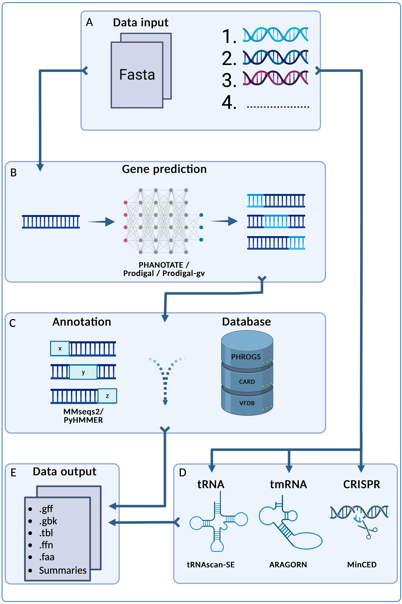

# `pharokka`

`pharokka` is a fast phage annotation pipeline.

# phold

If you like `pharokka`, you will probably love [phold](https://github.com/gbouras13/phold). `phold` uses structural homology to improve phage annotation. Benchmarking is ongoing but `phold` strongly outperforms `pharokka` in terms of annotation, particularly for less characterised phages such as those from metagenomic datasets.

`pharokka` still has features `phold` lacks for now (identifying tRNA, tmRNA, CRISPR repeats, and INPHARED taxonomy search), so it it recommended to run `phold` after running `pharokka`. 

`phold` takes the Genbank output of Pharokka as input. Therefore, if you have already annotated your phage(s) with Pharokka, you can easily update the annotation with more functional predictions with [phold](https://github.com/gbouras13/phold).

## Overview

`pharokka` uses [PHANOTATE](https://github.com/deprekate/PHANOTATE), the only gene prediction program tailored to bacteriophages, as the default program for gene prediction. [Prodigal](https://github.com/hyattpd/Prodigal) implemented with [pyrodigal](https://github.com/althonos/pyrodigal) and [Prodigal-gv](https://github.com/apcamargo/prodigal-gv) implemented with [pyrodigal-gv](https://github.com/althonos/pyrodigal-gv) are also available as alternatives. Following this, functional annotations are assigned by matching each predicted coding sequence (CDS) to the [PHROGs](https://phrogs.lmge.uca.fr), [CARD](https://card.mcmaster.ca) and [VFDB](http://www.mgc.ac.cn/VFs/main.htm) databases using [MMseqs2](https://github.com/soedinglab/MMseqs2). As of v1.4.0, `pharokka` will also match each CDS to the PHROGs database using more sensitive Hidden Markov Models using [PyHMMER](https://github.com/althonos/pyhmmer). Pharokka's main output is a GFF file suitable for using in downstream pangenomic pipelines like [Roary](https://sanger-pathogens.github.io/Roary/). `pharokka` also generates a `cds_functions.tsv` file, which includes counts of CDSs, tRNAs, tmRNAs, CRISPRs and functions assigned to CDSs according to the PHROGs database. See the full [usage](#usage) and check out the full [documentation](https://pharokka.readthedocs.io) for more details.  

## Manuscript

For more information, please read the `pharokka` manuscript:

George Bouras, Roshan Nepal, Ghais Houtak, Alkis James Psaltis, Peter-John Wormald, Sarah Vreugde, Pharokka: a fast scalable bacteriophage annotation tool, Bioinformatics, Volume 39, Issue 1, January 2023, btac776, [https://doi.org/10.1093/bioinformatics/btac776](https://doi.org/10.1093/bioinformatics/btac776)

# Google Colab Notebook

If you don't want to install `pharokka` locally, you can run it without any code using one [this Google Colab notebook](https://colab.research.google.com/github/gbouras13/phold/blob/main/run_pharokka_and_phold_and_phynteny.ipynb). 

Pharokka, Phold and Phynteny are complimentary tools and when used together, they substantially increase the annotation rate of your phage genome. The below plot shows the annotation rate of different tools across 4 benchmarked datasets ((a) INPHARED 1419, (b) Cook, (c) Crass and (d) Tara - see the [Phold preprint]((https://www.biorxiv.org/content/10.1101/2025.08.05.668817v1)) for more information)

Specifically, the final Phynteny plots combine the benefits of annotation with Pharokka (with HMM, the second violin) followed by Phold (with structures, the fourth violin) followed by Phynteny

  

